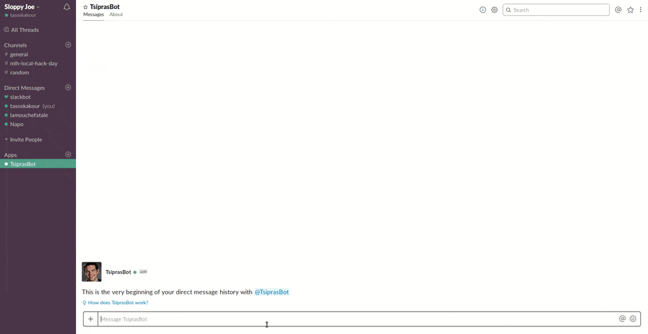

# sloppy-joe-bot

>A slackbot that uses IBM's Natural Language Understanding API, and Markov Chains, to generate Alexis Tsipras' rhetoric

[](./LICENSE)

## Demo



## Usage

1. Put your slackbot token in a file called 'token' in the root directory
2. Set up IBM's Natural Language Understanding platform properly
3. Set up environment variables:
    - **`SLACK_BOT_TOKEN`**: The token of the slack bot
    - **`WATSON_API_KEY`**: The api key for the IBM's natural language understanding module
4. Install dependencies:
    ```bash
    $ npm install
    ```
5. Start the bot:
    ```bash
    $ npm start
    ```
